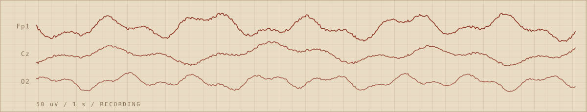

# ssommer.dev
 

 
Source for my personal site: a portfolio of machine learning work on neural and clinical signal data.
 
**Live:** https://ssommer.dev
 
---
 
## The instrument
 
The page is built as a **1940s EEG chart recorder**: Bakelite housing, oxide-red pen ink, amber indicator lamp. That isn't decoration. The hero is a live three-pen trace running across chart paper, which is the instrument the EEG work on this site actually comes from, and the same recorder Hans Berger was publishing from in 1929.
 
Everything else stays quiet so the trace is the one thing you remember.
 
---
 
## Specifications
 
| | |
|---|---|
| Chassis | Static HTML, one file, no framework, no build step |
| Finish | Hand-written CSS, custom properties in `:root` |
| Type | Big Shoulders Display · Archivo · IBM Plex Mono |
| Pen drive | `<canvas>` 2D, ~60 lines of vanilla JS |
| Auxiliary | Chatbase widget, one `<script>` block, optional |
| Power | GitHub Pages |
 
### Panel colors
 
Defined once in `:root`. Change them there and the whole page follows.
 
| Token | Hex | Where it shows |
|---|---|---|
| `--panel` | `#241f1b` | Bakelite housing, page background |
| `--chart` | `#e8dcc4` | chart paper |
| `--ink` | `#8c2e1f` | pen trace, primary button, card edge |
| `--lamp` | `#e0a32e` | indicator lamp, hover and focus states |
| `--bone` | `#d8cfc0` | body text |
 
---
 
## Layout
 
```
.
├── index.html                  # entire site: markup, styles, scripts
├── ssommer_Resume (4).pdf      # linked from the hero button
├── images/
│   └── Steve.jpg               # favicon
└── README.md
```
 
Sections, in order: hero, selected work, instruments, record, research, contact.
 
---
 
## Running it locally
 
Open `index.html` in a browser. That's it.
 
For a local server, needed only if you add fetch calls or routing:
 
```bash
python3 -m http.server 8000
# http://localhost:8000
```
 
---
 
## Deploying
 
Pushing to the default branch publishes to GitHub Pages. The custom domain lives in `CNAME` and in **Settings → Pages**.
 
---
 
## Accessibility
 
- Respects `prefers-reduced-motion` — the pens hold still and the trace renders as a single static frame.
- Visible keyboard focus rings on every interactive element.
- The canvas carries `role="img"` and a text label.
- Reflows to a single column below 560px.
---
 
## Contact
 
- Email — <ssommer.ai@gmail.com>
- GitHub — [@ssommera](https://github.com/ssommera)
- LinkedIn — [Stephen Sommer](https://www.linkedin.com/in/stephen-sommer-0a6bb0164/)
- YouTube — [channel](https://www.youtube.com/channel/UC3gU7MeGGn2jDfc2GNCFjKw)
---
 
## License
 
Code is MIT. Written content, résumé, and images are not — please don't reuse the copy or the layout wholesale as your own portfolio.